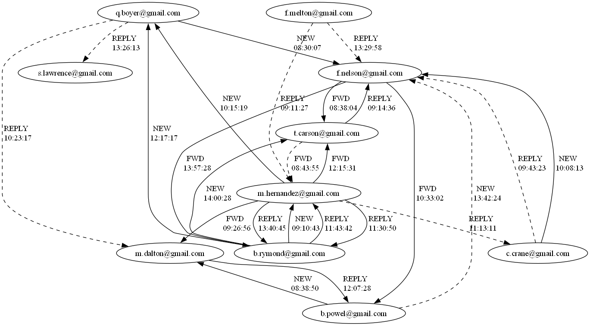

# Email Communication Generator

## Description
This project generates synthetic email communications based on predefined scenarios and optionally adds randomly generated noise emails.

The system works in two main steps:
1. Scenario emails are generated according to a CSV scenario file and templates.
2. Optional noise emails are generated randomly using separate templates and inserted into the communication timeline.

Outputs:
- An `.mbox` file containing all generated emails
- A directed communication graph where:
  - each node represents an email address
  - each edge represents an email
  - solid lines indicate scenario emails
  - dashed lines indicate noise emails
  - labels show email type and timestamp



## Installation & Running
1. Install the dependencies:
 ```bash
pip install -r requirements.txt
  ```
2. Run the program:
```bash
python comm_generator.py
```
## Configuration

|Variable | Description|
|---------|------------|
|`SCENARIOS_FOLDER` | Folder where scenario CSV files are stored |
|`SCENARIO_TEMPLATES_FOLDER` | Folder containing email templates used for scenario-based emails |
|`SCENARIO_FILENAME` | Name of the scenario CSV file to load |
|`OUT_FILENAME` | Name of the generated .mbox output file |
|`NOISE_LEVEL` | Multiplier controlling the number of noise emails to generate (0 = none)|
|`START_TIMESTAMP` |Starting timestamp for the first scenario email |
|`NOISE_TEMPLATES_FOLDER` | Folder containing noise email templates|
|`CONTACTS_FILE` | Path to the CSV file containing contacts information|
|`GRAPH_OUTPUT_FILE` | Output filename for generated communication graph (.png)|


## Customizing templates

### Contacts 
This file contains all people who may appear in scenario or noise emails.

|id|name|surname|email|
|--|----|-------|-----|
- `id` - unique identifier
- `name` - first name
- `surname` - last name
- `email` - email address

### Scenario

|e_id|t_max|from|to|type|template|param1|param2|fwd_id|
|----|-----|----|--|----|--------|------|------|------|

- `e_id` - unique email ID
- `t_max` - maximum time offset (in minutes) from the previous email
- `from` - sender ID from contacts
- `to` - recipient ID from contacts
- `type` - NEW, REPLY, FWD
- `template` - template file name
- `param1` / `param2` - values, inserted into $1 and $2
- `fwd_id` - ID of email to forward (only used when type = FWD)

### Scenario email template 
- First line must start with `#subject:` followed by the subject
- Remaining lines are the email body
- Placeholders `$1` and `$2` can be used and will be replaced with values from the scenario

### Noise email template
- Same as scenario templates, but without parameters
- First line: `#subject:`
- Remaining lines are the email body
